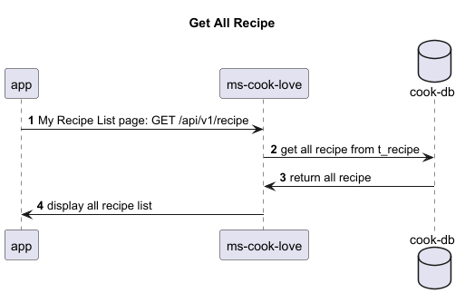
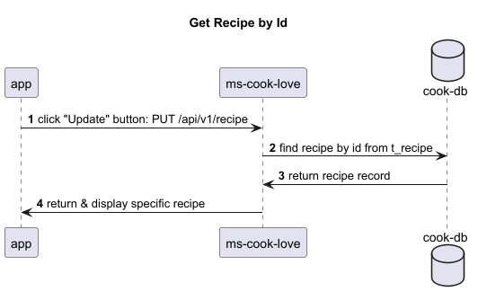
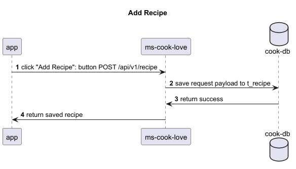
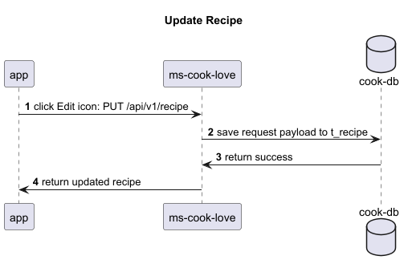
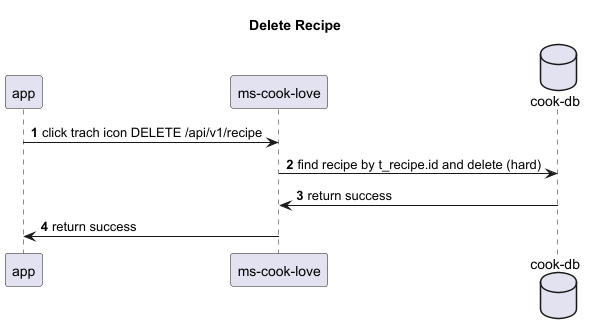
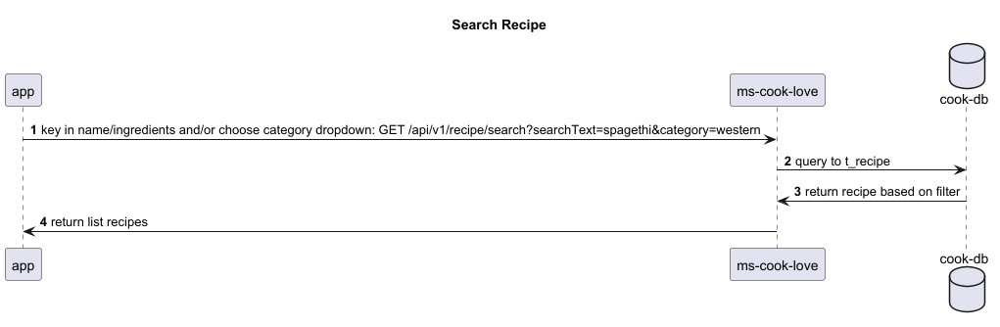
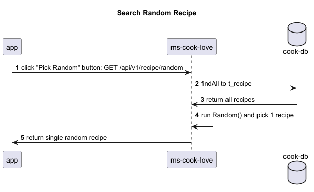

# ms-cook-love
This is microservice for CRUD recipe (create, read, update and delete recipe)

## Personal Project 
### Name: Cook with Love

#### Business Objective
1. To keep and mantain list of recipes for daily use
2. To be able to search and choose recipe for cooking

#### Technical Objective
1. To learn on full stack - building a full app with backend (microservices: spring boot) & front end (react js)
2. To learn hosting API (TBC)
3. To learn documentation and design a project

#### Technical Design

