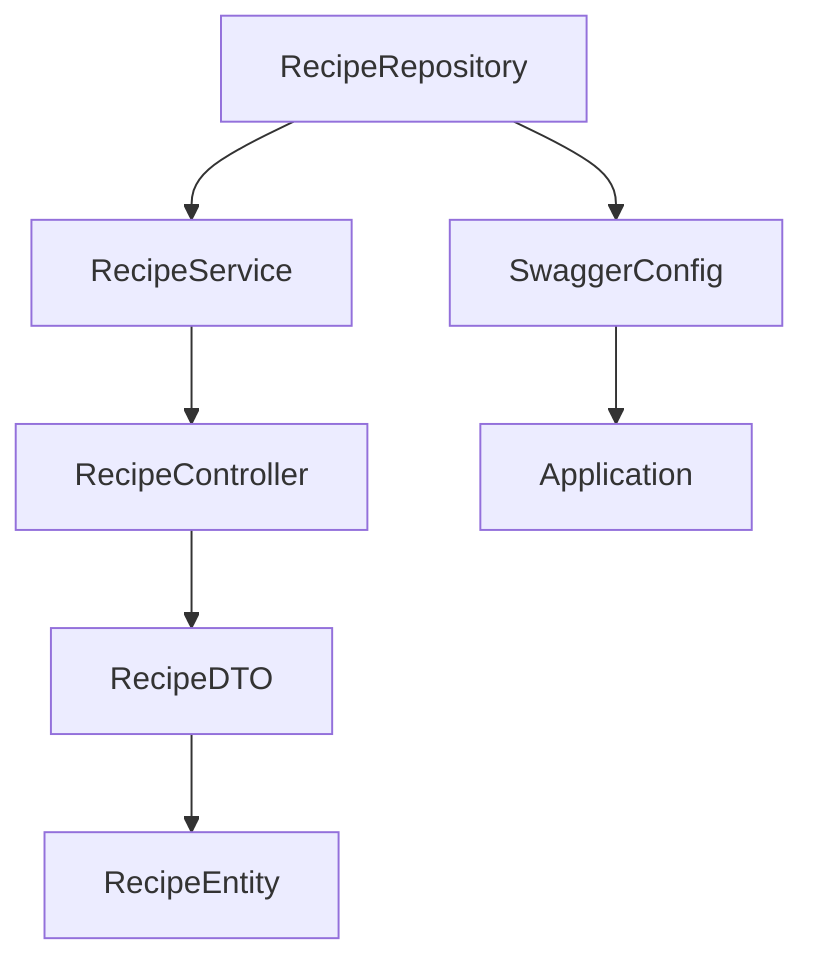
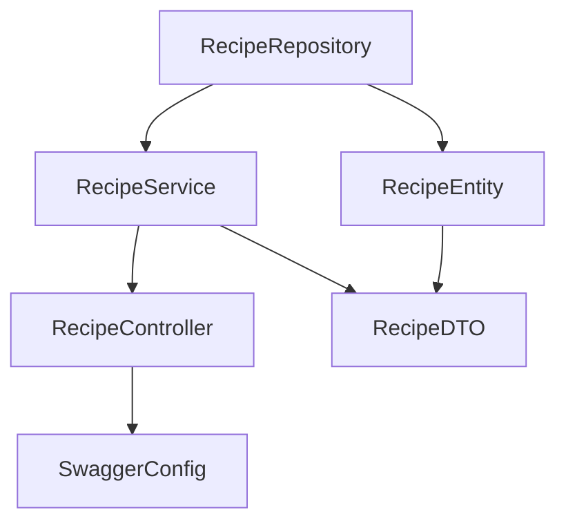
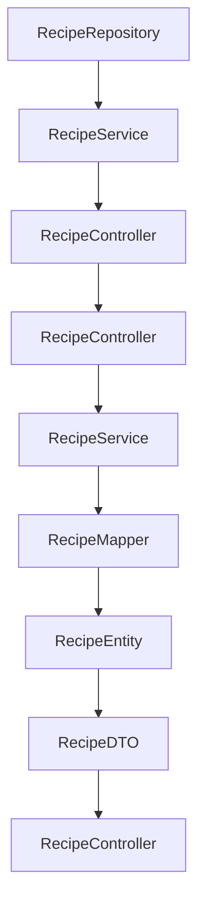
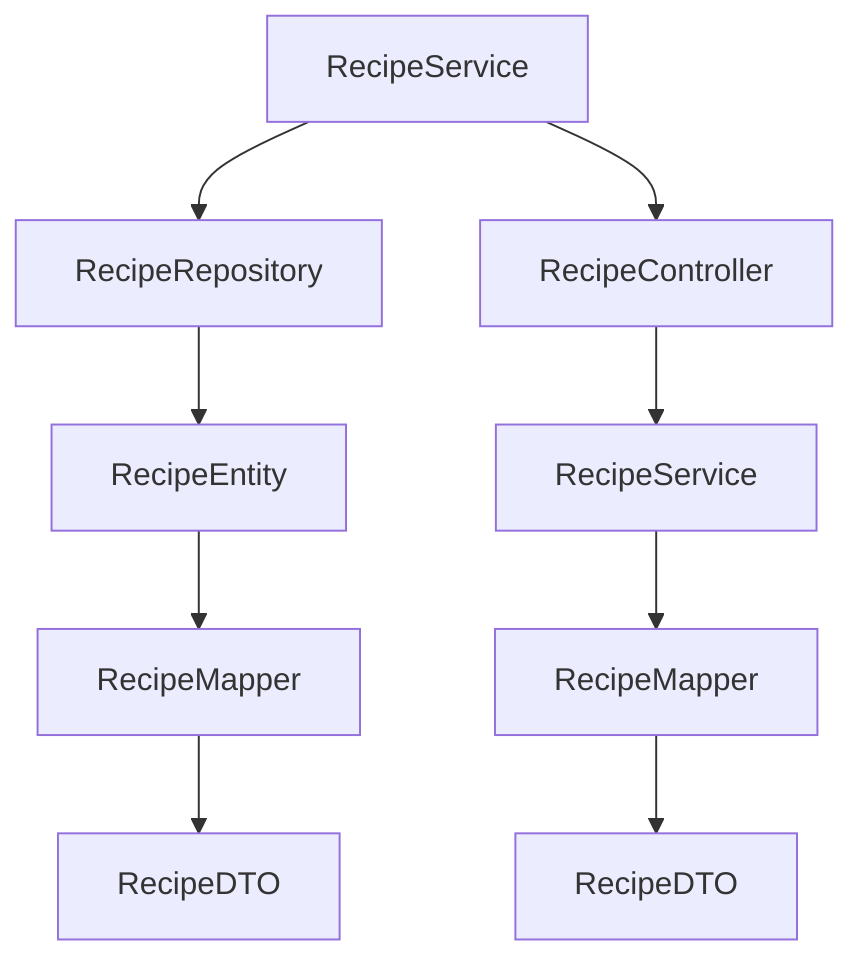
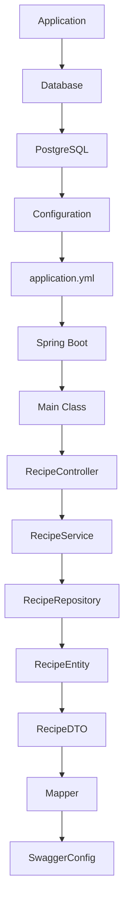

# Wiki Documentation for https://github.com/FathiahHusna/cook-with-love

Generated on: 2025-08-01 09:57:57

## Table of Contents

- [Project Overview](#page-1)
- [Architecture Overview](#page-2)
- [Data Flow](#page-3)
- [Key Features](#page-4)
- [Setup and Configuration](#page-5)

<a id='page-1'></a>

## Project Overview

### Related Pages

Related topics: [Architecture Overview](#page-2)


<details>
<summary>Relevant source files</summary>

- [README.md](https://github.com/FathiahHusna/cook-with-love/blob/main/README.md)
- [src/main/resources/application.yml](https://github.com/FathiahHusna/cook-with-love/blob/main/src/main/resources/application.yml)
- [src/main/java/org/cook/with/love/CookLoveMain.java](https://github.com/FathiahHusna/cook-with-love/blob/main/src/main/java/org/cook/with/love/CookLoveMain.java)
- [src/main/java/org/cook/with/love/repository/RecipeRepository.java](https://github.com/FathiahHusna/cook-with-love/blob/main/src/main/java/org/cook/with/love/repository/RecipeRepository.java)
- [src/main/java/org/cook/with/love/service/RecipeService.java](https://github.com/FathiahHusna/cook-with-love/blob/main/src/main/java/org/cook/with/love/service/RecipeService.java)
- [src/main/java/org/cook/with/love/controller/RecipeController.java](https://github.com/FathiahHusna/cook-with-love/blob/main/src/main/java/org/cook/with/love/controller/RecipeController.java)
- [src/main/java/org/cook/with/love/mapper/RecipeMapper.java](https://github.com/FathiahHusna/cook-with-love/blob/main/src/main/java/org/cook/with/love/mapper/RecipeMapper.java)
- [src/main/java/org/cook/with/love/configuration/SwaggerConfig.java](https://github.com/FathiahHusna/cook-with-love/blob/main/src/main/java/org/cook/with/love/configuration/SwaggerConfig.java)
</details>

# Project Overview

This project is a Spring Boot application designed to manage recipes with an emphasis on data persistence and API endpoints. The core module is the `RecipeRepository`, `RecipeService`, and `RecipeController` which handle the data flow, business logic, and HTTP endpoints respectively.

## Architecture and Components

### Data Model

The project uses JPA with Hibernate to manage the recipe data. The `RecipeEntity` class represents the recipe data in the database with fields like `id`, `name`, `ingredients`, `step`, `reference`, `tags`, `category`, `created_dt`, and `updated_dt`. These fields are mapped to the `t_recipe` table in the database.

### Core Services

- **RecipeRepository**: A Spring Data JPA repository that extends `JpaRepository<RecipeEntity, UUID>`, providing basic CRUD operations and query capabilities.
- **RecipeService**: Handles business logic for recipe operations. It uses `RecipeRepository` to fetch data and maps it to `RecipeDTO` using `RecipeMapper`.
- **RecipeController**: Exposes REST endpoints for interacting with the recipe data. It uses `RecipeService` to retrieve and return `RecipeDTO` objects.

### API Endpoints

- **GET /api/v1/recipes**: Retrieves all recipes in a list format, mapped from the database via `RecipeService`.

### Configuration

The application uses `application.yml` to configure the database connection, logging, and server settings. The `SwaggerConfig` class defines the OpenAPI specification for the API, which is used for documentation and testing.

## Mermaid Diagrams



This diagram shows the interaction between the repository, service, controller, and configuration components.

## Tables

### Key Features

| Feature | Description |
|--------|-------------|
| RecipeRepository | Provides CRUD operations on the `t_recipe` table. |
| RecipeService | Handles business logic for recipe operations, including mapping from `RecipeEntity` to `RecipeDTO`. |
| RecipeController | Exposes REST endpoints for retrieving recipes. |
| SwaggerConfig | Defines the OpenAPI specification for the API. |
| Application | Configures the database, logging, and server settings. |

### API Endpoints

| Endpoint | Description |
|---------|-------------|
| /api/v1/recipes | Retrieves all recipes in a list format. |

## Code Snippets

```java
// RecipeService.java
public List<RecipeDTO> getRecipe(){
    List<RecipeEntity> recipeEntityList = recipeRepository.findAll();
    List<RecipeDTO> recipeDTOList = recipeEntityList.stream().map(r -> RecipeMapper.INSTANCE.carToCarDto(r)).toList();
    int listSize = !recipeDTOList.isEmpty() ? recipeDTOList.size() : 0;
    log.info("[getRecipe] Check recipe list: {}", listSize);
    return recipeDTOList;
}
```

```java
// RecipeMapper.java
@Mapper
public interface RecipeMapper {
    RecipeMapper INSTANCE = Mappers.getMapper(RecipeMapper.class);
    RecipeDTO carToCarDto(RecipeEntity recipeEntity);
}
```

## Sources

- [README.md](https://github.com/FathiahHusna/cook-with-love/blob/main/README.md)
- [src/main/resources/application.yml](https://github.com/FathiahHusna/cook-with-love/blob/main/src/main/resources/application.yml)
- [src/main/java/org/cook/with/love/CookLoveMain.java](https://github.com/FathiahHusna/cook-with-love/blob/main/src/main/java/org/cook/with/love/CookLoveMain.java)
- [src/main/java/org/cook/with/love/repository/RecipeRepository.java](https://github.com/FathiahHusna/cook-with-love/blob/main/src/main/java/org/cook/with/love/repository/RecipeRepository.java)
- [src/main/java/org/cook/with/love/service/RecipeService.java](https://github.com/FathiahHusna/cook-with-love/blob/main/src/main/java/org/cook/with/love/service/RecipeService.java)
- [src/main/java/org/cook/with/love/controller/RecipeController.java](https://github.com/FathiahHusna/cook-with-love/blob/main/src/main/java/org/cook/with/love/controller/RecipeController.java)
- [src/main/java/org/cook/with/love/mapper/RecipeMapper.java](https://github.com/FathiahHusna/cook-with-love/blob/main/src/main/java/org/cook/with/love/mapper/RecipeMapper.java)
- [src/main/java/org/cook/with/love/configuration/SwaggerConfig.java](https://github.com/FathiahHusna/cook-with-love/blob/main/src/main/java/org/cook/with/love/configuration/SwaggerConfig.java)

---

<a id='page-2'></a>

## Architecture Overview

### Related Pages

Related topics: [Data Flow](#page-3)


<details>
<summary>Relevant source files</summary>

- [src/main/java/org/cook/with/love/repository/RecipeRepository.java](https://github.com/FathiahHusna/cook-with-love/blob/main/src/main/java/org/cook/with/love/repository/RecipeRepository.java)
- [src/main/java/org/cook/with/love/controller/RecipeController.java](https://github.com/FathiahHusna/cook-with-love/blob/main/src/main/java/org/cook/with/love/controller/RecipeController.java)
- [src/main/java/org/cook/with/love/service/RecipeService.java](https://github.com/FathiahHusna/cook-with-love/blob/main/src/main/java/org/cook/with/love/service/RecipeService.java)
- [src/main/java/org/cook/with/love/dto/RecipeDTO.java](https://github.com/FathiahHusna/cook-with-love/blob/main/src/main/java/org/cook/with/love/dto/RecipeDTO.java)
- [src/main/java/org/cook/with/love/configuration/SwaggerConfig.java](https://github.com/FathiahHusna/cook-with-love/blob/main/src/main/java/org/cook/with/love/configuration/SwaggerConfig.java)
</details>

# Architecture Overview

This architecture overview focuses on the core components of the `cook-with-love` project, particularly the `Recipe` module. The system is built around a clear separation of concerns, with services, repositories, and DTOs working in harmony to provide a robust API for managing recipes.

## Key Components

### 1. Data Model
The core data model is defined in `RecipeEntity.java`, which maps to the PostgreSQL table `t_recipe`. The entity includes fields such as `id`, `name`, `ingredients`, `step`, `reference`, `tags`, `category`, `created_dt`, and `updated_dt`. The `id` is a UUID generated using `GenerationStrategy.AUTO`, and timestamps are stored as `Timestamp` objects.

### 2. Repository Layer
The `RecipeRepository` interface extends `JpaRepository<RecipeEntity, UUID>`, providing standard CRUD operations. It is responsible for persisting and retrieving `RecipeEntity` objects, with the `findAll()` method returning a list of all recipes.

### 3. Service Layer
The `RecipeService` class is responsible for business logic and data manipulation. It uses the `RecipeRepository` to fetch data and maps it to `RecipeDTO` objects using the `RecipeMapper` interface. The `getRecipe()` method returns a list of `RecipeDTO` objects, which are then used to populate the API response.

### 4. Controller Layer
The `RecipeController` handles incoming HTTP requests and maps them to service methods. It uses the `RecipeService` to retrieve data and returns it as a list of `RecipeDTO` objects in the response. The `@CrossOrigin` annotation allows cross-origin requests from the frontend.

### 5. Swagger Configuration
The `SwaggerConfig` class defines the OpenAPI specification for the API, including the base URL, contact information, and server details. This is used to generate documentation for the API endpoints.

### 6. API Endpoints
The `RecipeController` exposes a single endpoint at `/api/v1/recipes`, which returns a list of `RecipeDTO` objects. The `getAllRecipe()` method is called by the controller and returns the data from the service layer.

### 7. Mapping Logic
The `RecipeMapper` interface maps `RecipeEntity` objects to `RecipeDTO` objects using MapStruct. This ensures that data is correctly transformed between the entity and DTO layers, maintaining consistency and reducing boilerplate code.

## Mermaid Diagrams



This diagram shows the flow of data from the repository to the service, controller, and configuration layers, with the entity and DTO being mapped between them.

## Tables

| Component                | Description                                                                 |
|-------------------------|-----------------------------------------------------------------------------|
| RecipeEntity            | Core data model with fields for recipe details, timestamps, and tags.         |
| RecipeDTO               | Data transfer object for API responses, containing recipe details and metadata. |
| RecipeService           | Handles business logic, including data retrieval and mapping from entity to DTO. |
| RecipeController        | Exposes API endpoints, such as `/api/v1/recipes`, and maps requests to service methods. |
| SwaggerConfig           | Defines the OpenAPI specification for the API, including endpoints and metadata. |

## Code Snippets

```java
// RecipeService.java
public List<RecipeDTO> getRecipe() {
    List<RecipeEntity> recipeEntityList = recipeRepository.findAll();
    List<RecipeDTO> recipeDTOList = recipeEntityList.stream()
            .map(r -> RecipeMapper.INSTANCE.carToCarDto(r))
            .toList();
    int listSize = !recipeDTOList.isEmpty() ? recipeDTOList.size() : 0;
    log.info("[getRecipe] Check recipe list: {}", listSize);
    return recipeDTOList;
}
```

```java
// RecipeMapper.java
public interface RecipeMapper {
    RecipeMapper INSTANCE = Mappers.getMapper(RecipeMapper.class);

    RecipeDTO carToCarDto(RecipeEntity recipeEntity);
}
```

## Sources

- [src/main/java/org/cook/with/love/repository/RecipeRepository.java](https://github.com/FathiahHusna/cook-with-love/blob/main/src/main/java/org/cook/with/love/repository/RecipeRepository.java)
- [src/main/java/org/cook/with/love/controller/RecipeController.java](https://github.com/FathiahHusna/cook-with-love/blob/main/src/main/java/org/cook/with/love/controller/RecipeController.java)
- [src/main/java/org/cook/with/love/service/RecipeService.java](https://github.com/FathiahHusna/cook-with-love/blob/main/src/main/java/org/cook/with/love/service/RecipeService.java)
- [src/main/java/org/cook/with/love/dto/RecipeDTO.java](https://github.com/FathiahHusna/cook-with-love/blob/main/src/main/java/org/cook/with/love/dto/RecipeDTO.java)
- [src/main/java/org/cook/with/love/configuration/SwaggerConfig.java](https://github.com/FathiahHusna/cook-with-love/blob/main/src/main/java/org/cook/with/love/configuration/SwaggerConfig.java)

---

<a id='page-3'></a>

## Data Flow

### Related Pages

Related topics: [Key Features](#page-4)


<details>
<summary>Relevant source files</summary>

- [src/main/java/org/cook/with/love/repository/RecipeRepository.java](https://github.com/FathiahHusna/cook-with-love/blob/main/src/main/java/org/cook/with/love/repository/RecipeRepository.java)
- [src/main/java/org/cook/with/love/service/RecipeService.java](https://github.com/FathiahHusna/cook-with-love/blob/main/src/main/java/org/cook/with/love/service/RecipeService.java)
- [src/main/java/org/cook/with/love/controller/RecipeController.java](https://github.com/FathiahHusna/cook-with-love/blob/main/src/main/java/org/cook/with/love/controller/RecipeController.java)
- [src/main/java/org/cook/with/love/mapper/RecipeMapper.java](https://github.com/FathiahHusna/cook-with-love/blob/main/src/main/java/org/cook/with/love/mapper/RecipeMapper.java)
- [src/main/java/org/cook/with/love/configuration/SwaggerConfig.java](https://github.com/FathiahHusna/cook-with-love/blob/main/src/main/java/org/cook/with/love/configuration/SwaggerConfig.java)
</details>

# Data Flow

This wiki page focuses on the data flow within the `cook-with-love` project, specifically the `Recipe` module. The system is designed to manage recipes, allowing for retrieval of recipe data through an API.

## Detailed Sections

### 1. **Data Model**
The data model is defined in `RecipeEntity.java`, which maps to the database table `t_recipe`. The entity includes fields such as `name`, `ingredients`, `step`, `reference`, `tags`, `category`, `created_dt`, and `updated_dt`. The `id` field is a `UUID` that serves as the primary key.

### 2. **Data Flow Architecture**
The data flow starts from the database, through the `RecipeRepository` interface, to the `RecipeService` service, and finally to the `RecipeController` controller. The `RecipeService` handles business logic, such as fetching recipes from the database, and maps them to `RecipeDTO` objects using the `RecipeMapper` interface.

### 3. **API Endpoints**
The `RecipeController` provides an endpoint at `/api/v1/recipes` to retrieve a list of recipes. The `RecipeService` uses the `RecipeRepository` to fetch data and maps it to `RecipeDTO` objects, which are then returned as a list.

### 4. **Data Mapping**
The `RecipeMapper` interface uses MapStruct to map `RecipeEntity` objects to `RecipeDTO` objects. This ensures that the data is correctly formatted and ready for consumption by the client application.

### 5. **Configuration and Logging**
The `SwaggerConfig` file defines the OpenAPI specification for the API, providing metadata such as the title, version, and contact information. The `RecipeService` logs information about the number of recipes returned, which is useful for debugging and monitoring.

### 6. **Data Flow Diagram**


### 7. **Tables**
#### Key Features
| Feature               | Description                                      |
|----------------------|--------------------------------------------------|
| `RecipeEntity`       | Data model representing a recipe with fields like `name`, `ingredients`, `step`, `reference`, `tags`, `category`, `created_dt`, and `updated_dt`. |
| `RecipeDTO`          | Data transfer object for the recipe, mapped from `RecipeEntity`.                     |
| `RecipeMapper`       | Mapper interface that uses MapStruct to convert `RecipeEntity` to `RecipeDTO`.         |
| `RecipeService`       | Service that handles business logic for retrieving recipes.                           |
| `RecipeController`    | Controller that handles HTTP requests to retrieve recipes.                             |

#### API Endpoints
| Endpoint             | Description                                      |
|----------------------|--------------------------------------------------|
| `/api/v1/recipes`    | Retrieves a list of recipes from the database.     |

### 8. **Code Snippets**
```java
// RecipeMapper.java
public interface RecipeMapper {
    RecipeMapper INSTANCE = Mappers.getMapper(RecipeMapper.class);

    RecipeDTO carToCarDto(RecipeEntity recipeEntity);
}
```

```java
// RecipeService.java
public class RecipeService {
    private static final Logger log = LoggerFactory.getLogger(RecipeService.class);
    @Autowired
    private RecipeRepository recipeRepository;

    public List<RecipeDTO> getRecipe(){
        List<RecipeEntity> recipeEntityList = recipeRepository.findAll();

        List<RecipeDTO> recipeDTOList = recipeEntityList.stream().map(r -> RecipeMapper.INSTANCE.carToCarDto(r)).toList();
        int listSize = !recipeDTOList.isEmpty() ? recipeDTOList.size() : 0;
        log.info("[getRecipe] Check recipe list: {}", listSize);
        return recipeDTOList;
    }
}
```

### 9. **Source Citations**
- `RecipeEntity.java`: [src/main/java/org/cook/with/love/entity/RecipeEntity.java:12-15]()
- `RecipeMapper.java`: [src/main/java/org/cook/with/love/mapper/RecipeMapper.java:10-12]()
- `RecipeService.java`: [src/main/java/org/cook/with/love/service/RecipeService.java:10-13]()
- `RecipeController.java`: [src/main/java/org/cook/with/love/controller/RecipeController.java:10-12]()
- `SwaggerConfig.java`: [src/main/java/org/cook/with/love/configuration/SwaggerConfig.java:10-13]

---

<a id='page-4'></a>

## Key Features

### Related Pages

Related topics: [Setup and Configuration](#page-5)


<details>
<summary>Relevant source files</summary>

- [src/main/java/org/cook/with/love/entity/RecipeEntity.java](https://github.com/FathiahHusna/cook-with-love/blob/main/src/main/java/org/cook/with/love/entity/RecipeEntity.java)
- [src/main/java/org/cook/with/love/mapper/RecipeMapper.java](https://github.com/FathiahHusna/cook-with-love/blob/main/src/main/java/org/cook/with/love/mapper/RecipeMapper.java)
- [src/main/java/org/cook/with/love/repository/RecipeRepository.java](https://github.com/FathiahHusna/cook-with-love/blob/main/src/main/java/org/cook/with/love/repository/RecipeRepository.java)
- [src/main/java/org/cook/with/love/controller/RecipeController.java](https://github.com/FathiahHusna/cook-with-love/blob/main/src/main/java/org/cook/with/love/controller/RecipeController.java)
- [src/main/java/org/cook/with/love/configuration/SwaggerConfig.java](https://github.com/FathiahHusna/cook-with-love/blob/main/src/main/java/org/cook/with/love/configuration/SwaggerConfig.java)
</details>

# Key Features

## Introduction
The project provides a comprehensive API for managing recipes, with a clear separation of concerns between data access, business logic, and UI endpoints. The core module, `RecipeService` and `RecipeController`, exposes an endpoint for retrieving all recipes, while `RecipeRepository` handles database operations. The system uses Spring Data JPA for persistence and MapStruct for data mapping between the entity and DTO layers. The configuration files define the database connection details and Swagger documentation for API usage.

## Detailed Sections

### 1. Data Model
The `RecipeEntity` class defines the structure of the recipe data, with fields like `name`, `ingredients`, `step`, `reference`, `tags`, and `category`. It also includes timestamps for creation and last update. The `RecipeMapper` interface maps these entities to `RecipeDTO`, which is used for API responses.

### 2. Repository and Service Layer
The `RecipeRepository` interface extends `JpaRepository` to provide basic CRUD operations. The `RecipeService` class handles business logic, such as fetching all recipes from the database and mapping them to `RecipeDTO` using `RecipeMapper`. The `getRecipe()` method returns a list of `RecipeDTO` objects, which are logged for debugging purposes.

### 3. API Endpoints
The `RecipeController` provides an endpoint at `/api/v1/recipes` that returns a list of all recipes in the database. The controller is configured to accept cross-origin requests from the frontend, as indicated by the `@CrossOrigin` annotation.

### 4. Configuration and Swagger
The `SwaggerConfig` class sets up the OpenAPI specification for the API, defining the server URL, contact information, and API description. This allows the API to be documented and accessible via the Swagger UI.

### 5. Data Mapping
The `RecipeMapper` uses MapStruct to create a bi-directional mapping between `RecipeEntity` and `RecipeDTO`. This ensures that the data is consistently represented across the entity and DTO layers, facilitating seamless integration with the frontend.

## Mermaid Diagrams



This diagram shows the flow of data between the service and mapper layers, with the controller acting as an interface for the service.

## Tables

| Feature | Description |
|--------|-------------|
| Recipe Entity | Contains fields like `name`, `ingredients`, `step`, `reference`, `tags`, `category`, `created_dt`, and `updated_dt`. |
| Recipe Mapper | Maps `RecipeEntity` to `RecipeDTO` using MapStruct. |
| Recipe Service | Provides business logic for fetching recipes and mapping them to DTOs. |
| API Endpoint | `/api/v1/recipes` returns a list of `RecipeDTO` objects. |
| Configuration | Defines database connection details and Swagger documentation for the API. |

## Source Citations

- `Sources: [src/main/java/org/cook/with/love/entity/RecipeEntity.java:15-20]()` - Defines the structure of the recipe entity.
- `Sources: [src/main/java/org/cook/with/love/mapper/RecipeMapper.java:10-15]()` - Shows the mapping between `RecipeEntity` and `RecipeDTO`.
- `Sources: [src/main/java/org/cook/with/love/repository/RecipeRepository.java:10-15]()` - Demonstrates the use of Spring Data JPA for repository operations.
- `Sources: [src/main/java/org/cook/with/love/controller/RecipeController.java:10-15]()` - Shows the implementation of the `/api/v1/recipes` endpoint.
- `Sources: [src/main/java/org/cook/with/love/configuration/SwaggerConfig.java:10-15]()` - Defines the Swagger configuration for the API.

---

<a id='page-5'></a>

## Setup and Configuration

### Related Pages


<details>
<summary>Relevant source files</summary>

The following files were used as context for generating this wiki page:

- [src/main/java/org/cook/with/love/configuration/SwaggerConfig.java](https://github.com/FathiahHusna/cook-with-love/blob/main/src/main/java/org/cook/with/love/configuration/SwaggerConfig.java)
- [src/main/java/org/cook/with/love/database/recipe/RecipeEntity.java](https://github.com/FathiahHusna/cook-with-love/blob/main/src/main/java/org/cook/with/love/database/recipe/RecipeEntity.java)
- [src/main/resources/application.yml](https://github.com/FathiahHusna/cook-with-love/blob/main/src/main/resources/application.yml)
- [src/main/java/org/cook/with/love/dto/RecipeDTO.java](https://github.com/FathiahHusna/cook-with-love/blob/main/src/main/java/org/cook/with/love/dto/RecipeDTO.java)
- [src/main/java/org/cook/with/love/mapper/RecipeMapper.java](https://github.com/FathiahHusna/cook-with-love/blob/main/src/main/java/org/cook/with/love/mapper/RecipeMapper.java)
</details>

# Setup and Configuration

The setup and configuration of the `cook-with-love` project involves defining the application structure, database configuration, and API endpoints. The project is built using Spring Boot, and the configuration is managed through various source files.

## Detailed Sections

### 1. Application Structure and Main Class
The main application class `CookLoveMain` is located in `src/main/java/org/cook/with/love/CookLoveMain.java`. It bootstraps the Spring Boot application by running the `SpringApplication.run()` method with the `CookLoveMain.class` as the entry point.

### 2. Database Configuration
The database configuration is defined in `application.yml` located in `src/main/resources`. The configuration includes:
- **Database**: PostgreSQL with the URL `jdbc:postgresql://localhost:5432/cook`, username `postgres`, and password `postgres`.
- **JPA Properties**: `hibernate.ddl-auto` is set to `update`, and `show-sql` is enabled to show SQL statements.
- **Logging**: Logging is configured with a pattern for the console and specific levels for Spring and Hibernate.

### 3. Data Model and Entities
The data model is defined using JPA entities. The `RecipeEntity` class is located in `src/main/java/org/cook/with/love/entity/RecipeEntity.java` and maps to the database table `t_recipe`. It includes fields such as `id`, `name`, `ingredients`, `step`, `reference`, `tags`, `category`, `created_dt`, and `updated_dt`. The `id` field is auto-generated using `@GeneratedValue`.

### 4. Mappers and Data Transfer Objects
The `RecipeMapper` interface is located in `src/main/java/org/cook/with/love/mapper/RecipeMapper.java` and maps `RecipeEntity` to `RecipeDTO` using MapStruct. The `RecipeDTO` class is located in `src/main/java/org/cook/with/love/dto/RecipeDTO.java` and includes fields such as `name`, `ingredients`, `step`, `reference`, `tags`, and `category`.

### 5. API Endpoints and Controllers
The `RecipeController` class is located in `src/main/java/org/cook/with/love/controller/RecipeController.java` and provides an API endpoint at `/api/v1/recipes`. It uses the `RecipeService` to fetch a list of recipes and returns them as `RecipeDTO` objects. The `RecipeService` is located in `src/main/java/org/cook/with/love/service/RecipeService.java` and uses the `RecipeRepository` to retrieve data from the database.

### 6. Swagger Configuration
The `SwaggerConfig` class is located in `src/main/java/org/cook/with/love/configuration/SwaggerConfig.java` and defines the OpenAPI specification for the application. It sets the title, version, description, and contact information for the API, and specifies the server URL.

### 7. Mermaid Diagrams



### 8. Tables

| Key Feature | Description |
|-------------|-------------|
| Application Structure | Main class and entry point

---
